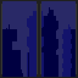

# 30 Day of Game Development Challenge

Code any game or practice Game Development every day for the next 30 days
OR, create a game in 30 days and publish it (itch.io, Steam, Google Play, App Store, etc.)

Day 1 (May 4, 2020)

### Coding:
Completed the first week of *Character Design for Video Games*\
Completed 1/3 of the first week of *C++ Yellow Belt*\
### Art:

